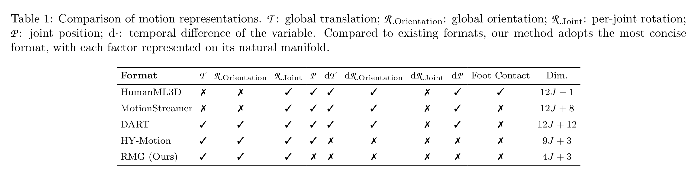
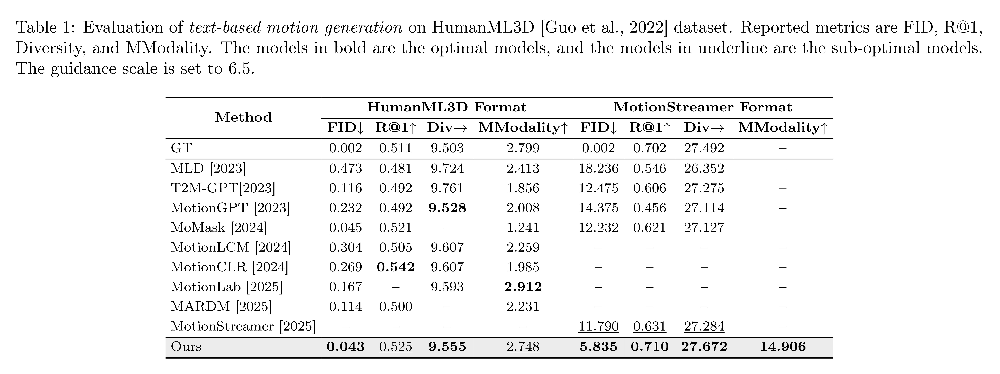
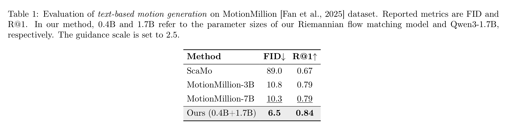

```{=html}
<!-- ══════════════════════════════════════════════════════════════════════════
     HERO: Title, Authors, Affiliations, Links
     ══════════════════════════════════════════════════════════════════════════ -->
<section class="hero">
  <div class="hero-body">
    <div class="container is-max-desktop">
      <div class="columns is-centered">
        <div class="column has-text-centered">

          <!-- Paper Title — auto-injected from front matter title: -->
          <h1 class="title is-1 publication-title">
            
          </h1>

          <!-- Subtitle — auto-injected from front matter description: -->
          <h2 class="subtitle is-4 publication-title" style="font-weight: normal; margin-top: 0.5rem;">
            
          </h2>

          <!-- Authors — add/remove <span class="author-block"> as needed -->
          <div class="is-size-5 publication-authors">
            <span class="author-block">
              Fangran Miao<sup>1</sup><sup><a href="mailto:fangran.miao@connect.polyu.hk" class="author-email" aria-label="Email Fangran Miao"><i class="fas fa-envelope"></i></a></sup>,
            </span>
            <span class="author-block">
              Jian Huang<sup>1</sup>,
            </span>
            <span class="author-block">
              Ting Li<sup>2</sup>
            </span>
          </div>

          <!-- Affiliations — match superscripts above -->
          <div class="is-size-5 publication-authors">
            <span class="author-block"><sup>1</sup>PolyU,</span>
            <span class="author-block"><sup>2</sup>SUSTech</span>
          </div>

          <!-- Publication Links — add/remove buttons as needed -->
          <div class="column has-text-centered">
            <div class="publication-links">

              <!-- arXiv -->
              <span class="link-block">
                <a href="https://arxiv.org/abs/2011.12948"
                   class="external-link button is-normal is-rounded is-dark">
                  <span class="icon"></span>
                  <span>arXiv</span>
                </a>
              </span>

              <!-- Code -->
              <!-- <span class="link-block">
                <a href="https://github.com/frank-miao/RMG"
                   class="external-link button is-normal is-rounded is-dark">
                  <span class="icon"></span>
                  <span>Code</span>
                </a>
              </span> -->

              <!-- Hugging Face -->
              <span class="link-block">
                <a href="https://huggingface.co/spaces/Frank-miao/RMG"
                   class="external-link button is-normal is-rounded is-dark">
                  <span class="icon"></span>
                  <span>Demo</span>
                </a>
              </span>

              <!-- Hugging Face Model Weights -->
              <!-- <span class="link-block">
                <a href="https://huggingface.co/collections/Frank-miao/rmg"
                   class="external-link button is-normal is-rounded is-dark">
                  <span class="icon"></span>
                  <span>Model Weights</span>
                </a>
              </span> -->

            </div>
          </div>
          <!-- /Publication Links -->

           <h3 class="subtitle is-4 publication-title" style="font-weight: normal; margin-top: 0.5rem;">
            Code and model weights will be coming soon!
          </h3>

        </div>
      </div>
    </div>
  </div>
</section>
```

::: {.desktop-section container="is-fluid"}
::: {layout-ncol=2 style="padding: 0 4rem;"}
![**Left:** Illustration of the unified Riemannian representation for articulated motion. Each motion frame can be factorized into [**global translation** $(\mathcal{M}_{\mathcal{T}})$]{style="color: rgb(205,144,114)"}, [**global orientation and per-joint rotations** $(\mathcal{M}_{\mathcal{R}})$]{style="color: rgb(205,144,114)"}, and [**local pose** $(\mathcal{M}_{\mathcal{P}})$]{style="color: rgb(205,144,114)"} along with the [**temporal differences** $(T\mathcal{M}_{\mathcal{F}}\ \text{for}\ \mathcal{F}\in\{\mathcal{T},\mathcal{R},\mathcal{P}\})$]{style="color: rgb(101,165,66)"}.](./static/images/RMG-illustration-1.png)


:::
:::

::: {.desktop-section}

## Abstract

::: {.has-text-justified style="text-align: justify; font-size: 1.15rem;"}

Human motion generation is often learned in Euclidean spaces, although valid motions follow structured non-Euclidean geometry. We present \textbf{Riemannian Motion Generation (RMG)}, a unified framework that represents motion on a product manifold and learns dynamics via Riemannian flow matching. RMG factorizes motion into several manifold factors, yielding a scale-free representation with intrinsic normalization, and uses geodesic interpolation, tangent-space supervision, and manifold-preserving ODE integration for training and sampling. On HumanML3D, RMG achieves state-of-the-art FID in the HumanML3D format (0.043) and ranks first on all reported metrics under the MotionStreamer format. On MotionMillion, it also surpasses strong baselines (FID 6.5, R@1 0.84). Ablations show that the compact $\mathcal{T}+\mathcal{R}$ (translation + rotations) representation is the most stable and effective, highlighting geometry-aware modeling as a practical and scalable route to high-fidelity motion generation. In addition, our code has been made publicly available.

:::

::: {style="margin-top: 2.5rem;"}

## Motion Representation Comparison



:::
:::


```{=html}
<!-- ══════════════════════════════════════════════════════════════════════════
     RESULTS GRID: Showcase videos (replaces the original Carousel)
     Add/remove <div class="column is-half"> blocks as needed.
     ══════════════════════════════════════════════════════════════════════════ -->
<section class="hero is-light is-small">
  <div class="hero-body">
    <div class="container">
      <h2 class="title is-2 has-text-centered" style="margin-bottom: 1.5rem;">Showcase Videos</h2>
      <div class="columns is-multiline results-grid">

        <div class="column is-one-third">
          <div class="item">
            <video autoplay controls muted loop playsinline>
              <source src="static/videos/A man is performing Tai-chi movement.mp4" type="video/mp4">
            </video>
          </div>
        </div>

        <div class="column is-one-third">
          <div class="item">
            <video autoplay controls muted loop playsinline>
              <source src="static/videos/A man is running on a treadmill.mp4" type="video/mp4">
            </video>
          </div>
        </div>

        <div class="column is-one-third">
          <div class="item">
            <video autoplay controls muted loop playsinline>
              <source src="static/videos/A person is doing jumping jacks.mp4" type="video/mp4">
            </video>
          </div>
        </div>

        <div class="column is-one-third">
          <div class="item">
            <video autoplay controls muted loop playsinline>
              <source src="static/videos/A person jumps several times.mp4" type="video/mp4">
            </video>
          </div>
        </div>

        <div class="column is-one-third">
          <div class="item">
            <video autoplay controls muted loop playsinline>
              <source src="static/videos/A person remains still at first, and then jumps and spins around once.mp4" type="video/mp4">
            </video>
          </div>
        </div>

        <div class="column is-one-third">
          <div class="item">
            <video autoplay controls muted loop playsinline>
              <source src="static/videos/A person slightly bent over with right hand pressing against the air walks forward slowly.mp4" type="video/mp4">
            </video>
          </div>
        </div>

        <div class="column is-one-third">
          <div class="item">
            <video autoplay controls muted loop playsinline>
              <source src="static/videos/A person squats down and then jumps.mp4" type="video/mp4">
            </video>
          </div>
        </div>

        <div class="column is-one-third">
          <div class="item">
            <video autoplay controls muted loop playsinline>
              <source src="static/videos/A person walking in a clockwise circle.mp4" type="video/mp4">
            </video>
          </div>
        </div>

        <div class="column is-one-third">
          <div class="item">
            <video autoplay controls muted loop playsinline>
              <source src="static/videos/A person walking in a counter-clockwise circle.mp4" type="video/mp4">
            </video>
          </div>
        </div>

        <div class="column is-one-third">
          <div class="item">
            <video autoplay controls muted loop playsinline>
              <source src="static/videos/A person climbs a ladder.mp4" type="video/mp4">
            </video>
          </div>
        </div>

        <div class="column is-one-third">
          <div class="item">
            <video autoplay controls muted loop playsinline>
              <source src="static/videos/Person turns to left, takes three steps forward, sits down, and then walks back to starting place.mp4" type="video/mp4">
            </video>
          </div>
        </div>

        <div class="column is-one-third">
          <div class="item">
            <video autoplay controls muted loop playsinline>
              <source src="static/videos/The man walked forward, spun right on one foot and walked back to his original position.mp4" type="video/mp4">
            </video>
          </div>
        </div>

      </div>
    </div>
  </div>
</section>
```

```{=html}
<section class="hero is-small same-prompts-section">
  <div class="hero-body">
    <div class="container">
      <h2 class="title is-2 has-text-centered" style="margin-bottom: 1.5rem;">Same Prompts, Diverse Motions</h2>
      <h3 class="prompt-row-title">A person stands on one legs in yoga pose</h3>
      <div class="prompt-groups-scroller">
        <article class="prompt-group-card">
          <div class="prompt-video-row">
            <div class="prompt-video-card">
              <video autoplay controls muted loop playsinline>
                <source src="static/videos/A person stands on one legs in yoga pose/motion_1.mp4" type="video/mp4">
              </video>
            </div>
          </div>
        </article>

        <article class="prompt-group-card">
          <div class="prompt-video-row">
            <div class="prompt-video-card">
              <video autoplay controls muted loop playsinline>
                <source src="static/videos/A person stands on one legs in yoga pose/motion_2.mp4" type="video/mp4">
              </video>
            </div>
          </div>
        </article>

        <article class="prompt-group-card">
          <div class="prompt-video-row">
            <div class="prompt-video-card">
              <video autoplay controls muted loop playsinline>
                <source src="static/videos/A person stands on one legs in yoga pose/motion_3.mp4" type="video/mp4">
              </video>
            </div>
          </div>
        </article>

        <article class="prompt-group-card">
          <div class="prompt-video-row">
            <div class="prompt-video-card">
              <video autoplay controls muted loop playsinline>
                <source src="static/videos/A person stands on one legs in yoga pose/motion_4.mp4" type="video/mp4">
              </video>
            </div>
          </div>
        </article>

        <article class="prompt-group-card">
          <div class="prompt-video-row">
            <div class="prompt-video-card">
              <video autoplay controls muted loop playsinline>
                <source src="static/videos/A person stands on one legs in yoga pose/motion_5.mp4" type="video/mp4">
              </video>
            </div>
          </div>
        </article>
        
      </div>

      <h3 class="prompt-row-title">A man performs a standing back kick</h3>
      <div class="prompt-groups-scroller">
        <article class="prompt-group-card">
          <div class="prompt-video-row">
            <div class="prompt-video-card">
              <video autoplay controls muted loop playsinline>
                <source src="static/videos/A man performs a standing back kick/motion_1.mp4" type="video/mp4">
              </video>
            </div>
          </div>
        </article>

        <article class="prompt-group-card">
          <div class="prompt-video-row">
            <div class="prompt-video-card">
              <video autoplay controls muted loop playsinline>
                <source src="static/videos/A man performs a standing back kick/motion_2.mp4" type="video/mp4">
              </video>
            </div>
          </div>
        </article>

        <article class="prompt-group-card">
          <div class="prompt-video-row">
            <div class="prompt-video-card">
              <video autoplay controls muted loop playsinline>
                <source src="static/videos/A man performs a standing back kick/motion_3.mp4" type="video/mp4">
              </video>
            </div>
          </div>
        </article>

        <article class="prompt-group-card">
          <div class="prompt-video-row">
            <div class="prompt-video-card">
              <video autoplay controls muted loop playsinline>
                <source src="static/videos/A man performs a standing back kick/motion_4.mp4" type="video/mp4">
              </video>
            </div>
          </div>
        </article>

        <article class="prompt-group-card">
          <div class="prompt-video-row">
            <div class="prompt-video-card">
              <video autoplay controls muted loop playsinline>
                <source src="static/videos/A man performs a standing back kick/motion_5.mp4" type="video/mp4">
              </video>
            </div>
          </div>
        </article>
        
      </div>

      <h3 class="prompt-row-title">The person does a salsa dance</h3>
      <div class="prompt-groups-scroller">
        <article class="prompt-group-card">
          <div class="prompt-video-row">
            <div class="prompt-video-card">
              <video autoplay controls muted loop playsinline>
                <source src="static/videos/The person does a salsa dance/motion_1.mp4" type="video/mp4">
              </video>
            </div>
          </div>
        </article>

        <article class="prompt-group-card">
          <div class="prompt-video-row">
            <div class="prompt-video-card">
              <video autoplay controls muted loop playsinline>
                <source src="static/videos/The person does a salsa dance/motion_2.mp4" type="video/mp4">
              </video>
            </div>
          </div>
        </article>

        <article class="prompt-group-card">
          <div class="prompt-video-row">
            <div class="prompt-video-card">
              <video autoplay controls muted loop playsinline>
                <source src="static/videos/The person does a salsa dance/motion_3.mp4" type="video/mp4">
              </video>
            </div>
          </div>
        </article>

        <article class="prompt-group-card">
          <div class="prompt-video-row">
            <div class="prompt-video-card">
              <video autoplay controls muted loop playsinline>
                <source src="static/videos/The person does a salsa dance/motion_4.mp4" type="video/mp4">
              </video>
            </div>
          </div>
        </article>

        <article class="prompt-group-card">
          <div class="prompt-video-row">
            <div class="prompt-video-card">
              <video autoplay controls muted loop playsinline>
                <source src="static/videos/The person does a salsa dance/motion_5.mp4" type="video/mp4">
              </video>
            </div>
          </div>
        </article>
        
      </div>

    </div>
  </div>
</section>
```


::: {.desktop-section}

## Results

### Text-based Motion Generation on HumanML3D



### Text-based Motion Generation on MotionMillion



## BibTeX {#BibTeX}

```bibtex
@article{rmg,
  author    = {Fangran MIAO, Jian HUANG, Ting LI},
  title     = {Riemannian Motion Generation: A Unified Framework for Motion Representation and Generation via Riemannian Flow Matching},
  journal   = {arxiv},
  year      = {2026},
}
```

:::
