## Motivation

:::: columns

::: {.column width="58%"}

::: {.fragment}
### Why revisit motion representation?

::: {.incremental}
- Most human motion generators still learn in high-dimensional Euclidean coordinates.
- Valid articulated motion has strong geometric structure and lower intrinsic dimension.
- Redundant representations make optimization harder and validity more fragile.
:::

:::
:::

::: {.column width="42%"}
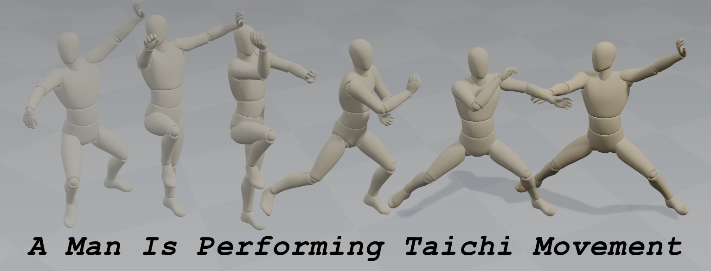{fig-alt="Generated motion sample for Tai Chi." width="100%"}
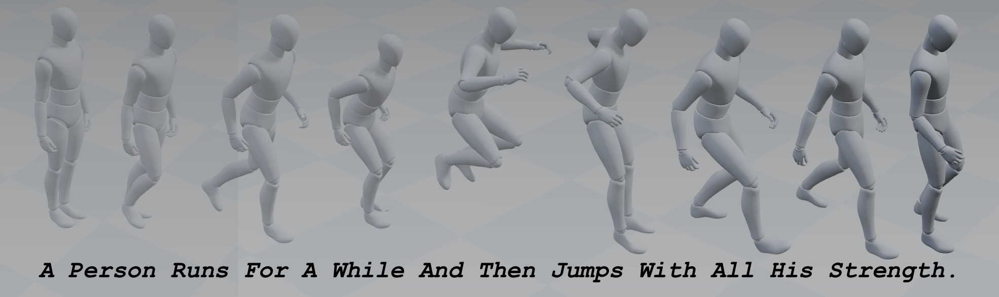{fig-alt="Generated motion sample for running and jumping." width="100%"}
:::

::::

::: {.fragment}
### Core question

Can we represent motion by using it natural geometry?
:::

## Main Idea

### RMG in one sentence

**Represent motion as a product manifold and learn the generation dynamics with Riemannian flow matching.**

### What this gives us

- Scale-free motion representation with intrinsic normalization
- Geodesic interpolation instead of straight-line interpolation in ambient space
- Manifold-preserving ODE integration during sampling

## Methodology

### Factorization

For one motion frame, we use:

- Global translation $\mathcal{T}$: $\mathbb{R}^3$
- Global orientation + joint rotations $\mathcal{R}$: $\mathbb{S}^3 \times \mathbb{S}^3 \cdots \mathbb{S}^3$
- Relative local pose $\mathcal{P}$: $\mathcal{S}^J_3$ -- Kendall pre-shape space
- Temporal differences: $\mathrm{d}\mathcal{T}$, $\mathrm{d}\mathcal{R}$, $\mathrm{d}\mathcal{P}$

### Key design choice

We unify prior formats under one geometric view, then choose the compact manifold (translation + rotations) for the main RMG model:

$$\mathcal{M}_{\mathrm{RMG}} = \mathcal{M}_{\mathcal{T}}\times \mathcal{M}_{\mathcal{R}} = \mathbb{R}^3 \times (\mathbb{S}^3)^J$$

---

### Comparisons

{fig-alt="Comparison of RMG with prior methods on motion representation." width="100%"}

---

### Prior distribution

#### Which manifold prior?

:::::: columns

::: {.column width="20%"}
::: {.fragment fragment-index=1}
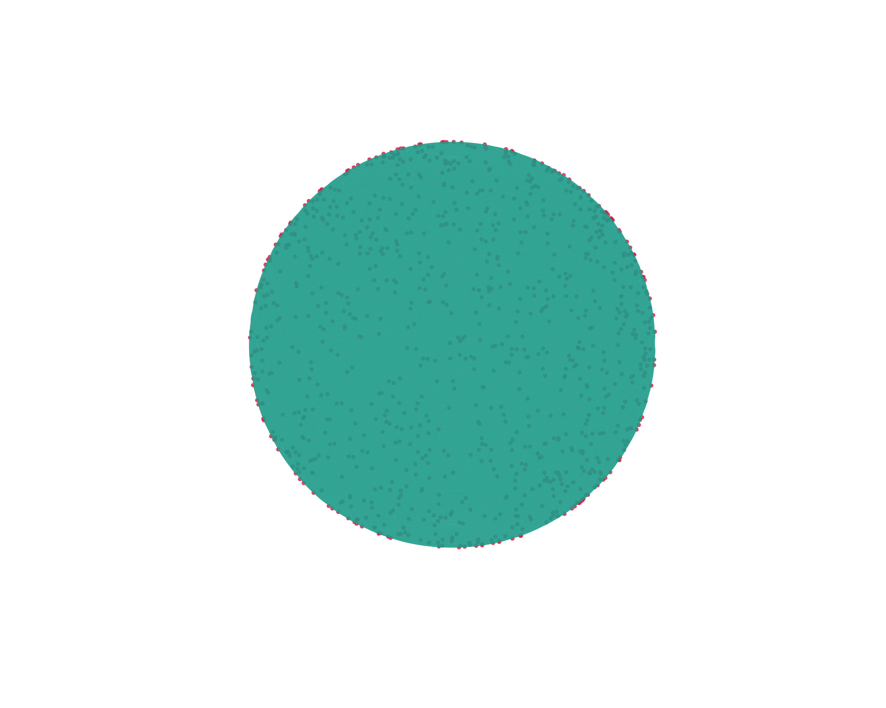{fig-alt="Comparison of different manifold priors." width="100%"}
:::
:::

::: {.column width="20%"}
::: {.fragment fragment-index=2}
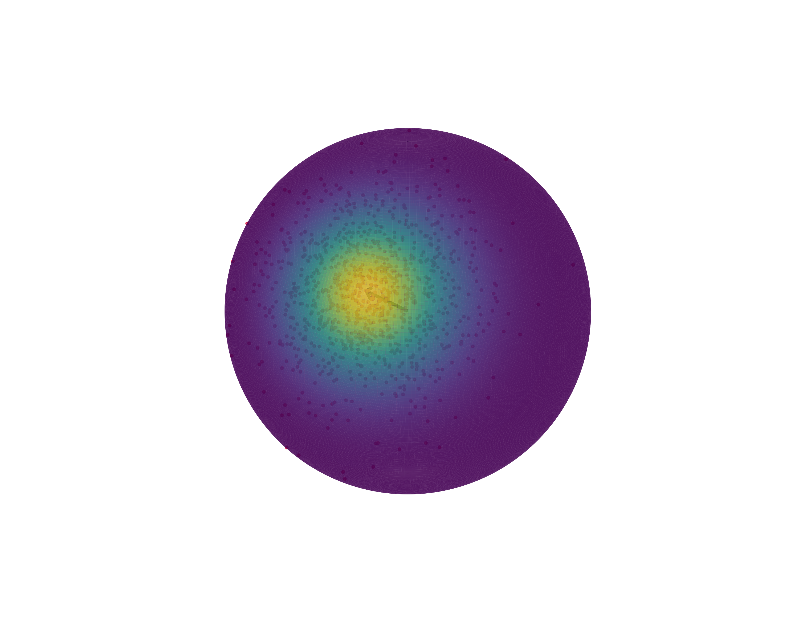{fig-alt="Comparison of different manifold priors." width="100%"}
:::
:::

::: {.column width="20%"}
::: {.fragment fragment-index=2}
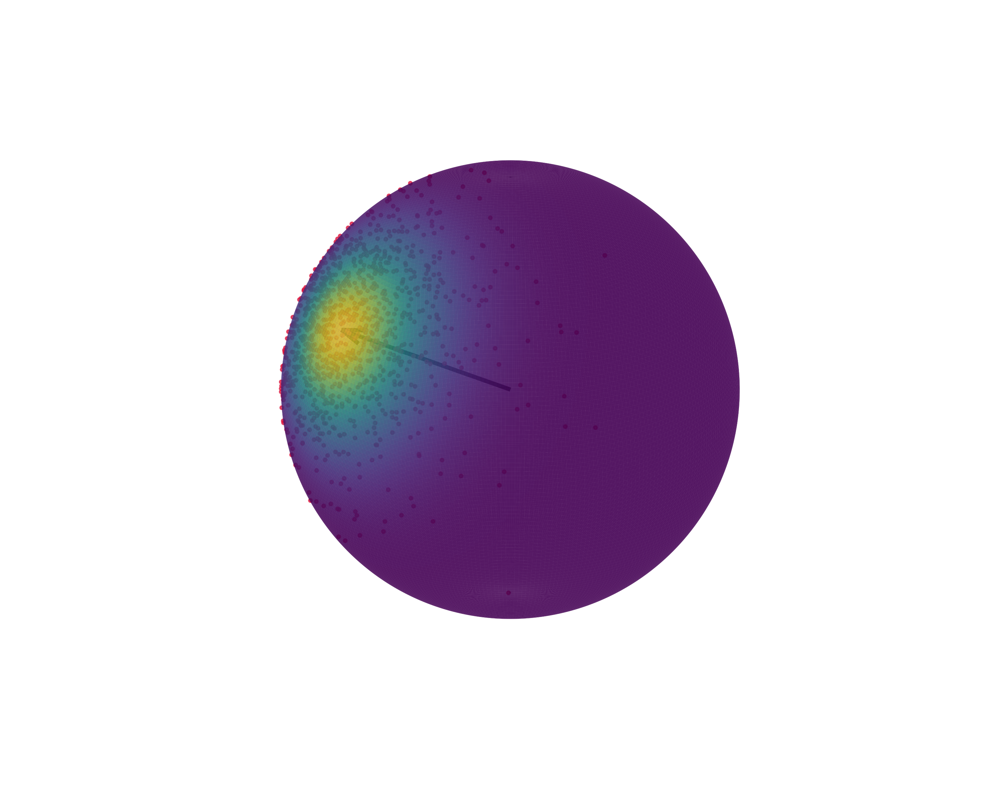{fig-alt="Comparison of different manifold priors." width="100%"}
:::
:::

::: {.column width="20%"}
::: {.fragment fragment-index=3}
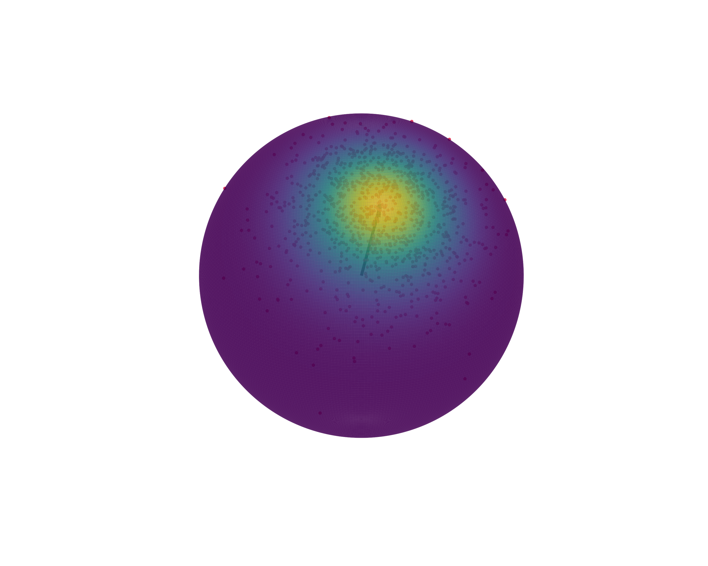{fig-alt="Comparison of different manifold priors." width="100%"}
:::
:::

::: {.column width="20%"}
::: {.fragment fragment-index=3}
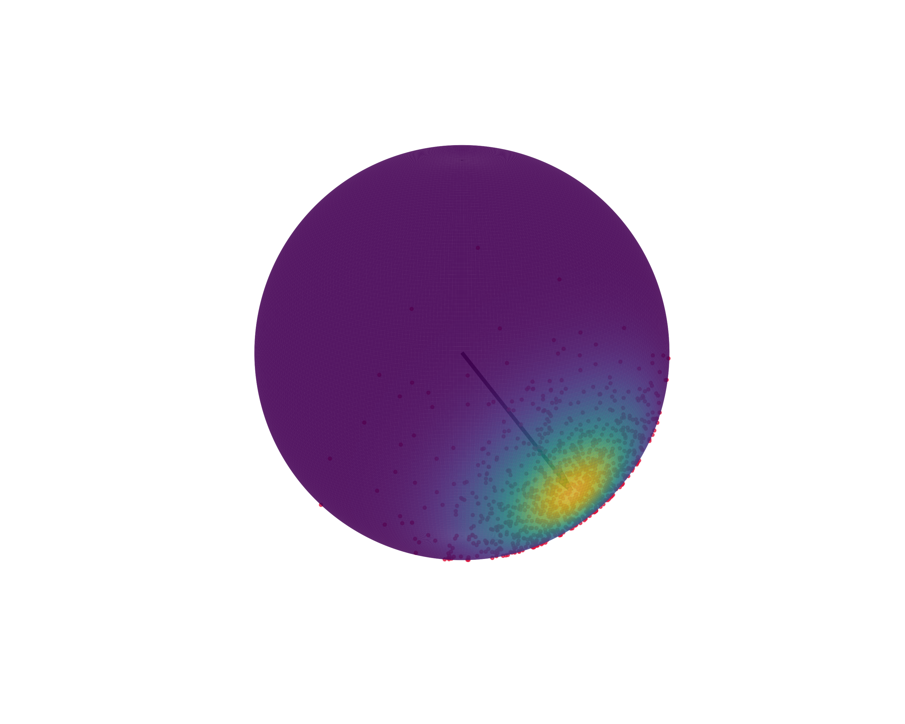{fig-alt="Comparison of different manifold priors." width="100%"}
:::
:::

::::::


::: {.fragment fragment-index=1}

$$\mathrm{Uniform\ distribution}: X\sim \mathrm{Uniform}(\mathbb{S}^3)$$

:::

::: {.fragment fragment-index=2}

$$\mathrm{Riemannian\ Gaussian\ distribution}: X\sim \mathcal{RN}(\mu, \Sigma)$$

:::

::: {.fragment fragment-index=3}

$$\mathrm{von\ Mises–Fisher\ distribution}: X\sim \mathrm{vMF}(\mu, \kappa)$$

:::


---

### The choice of mean vector

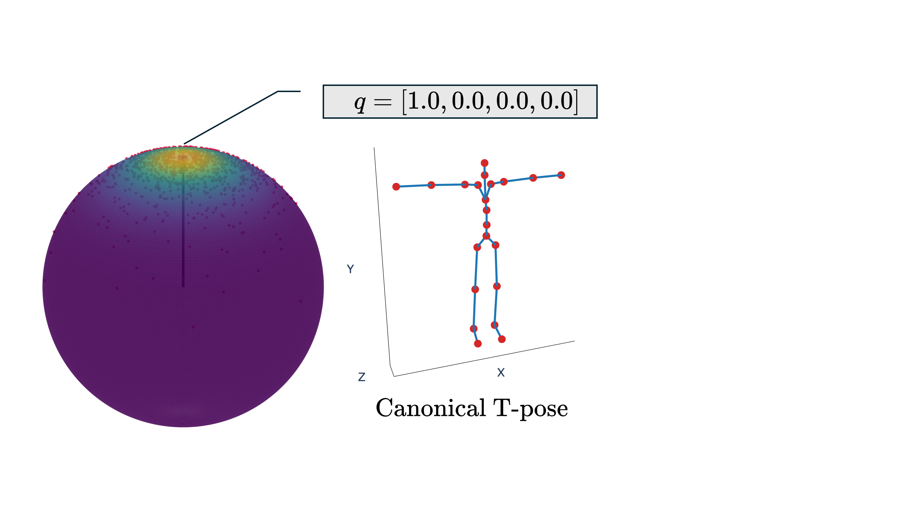{fig-alt="Illustration of different mean vector choices for the von Mises-Fisher distribution." width="80%" fig-align="center"}


---

### Training

1. Sample prior motion $x_0$ on the manifold and data motion $x_1$.
2. Build the interpolation state $x_t = \text{Exp}_{x_0}(t \text{Log}_{x_0}(x_1))$.
3. Supervise the model with the geodesic tangent velocity.
4. Project predicted velocity onto the tangent space before computing loss.

### Inference

- Start from the manifold prior
- Integrate the learned ODE on the manifold
- Use Riemannian Euler updates to preserve constraints by construction

---

### Overview

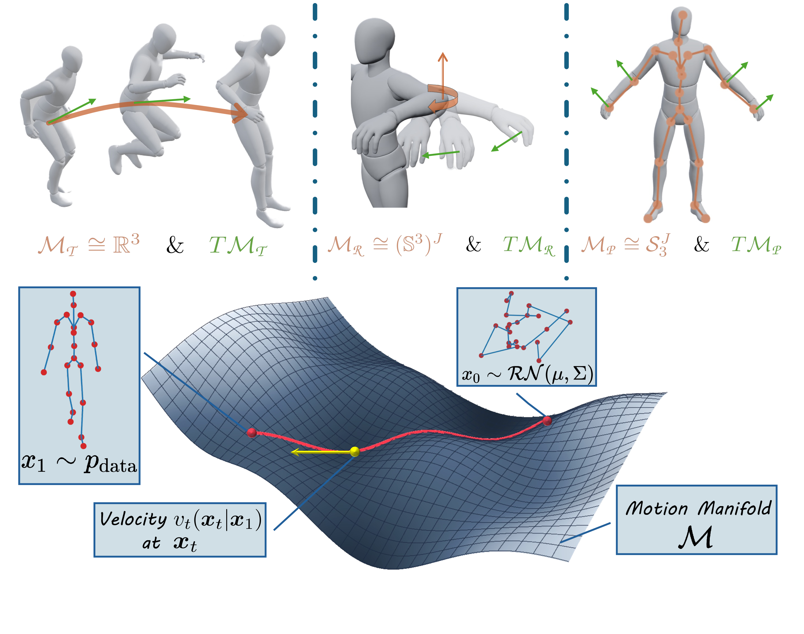{fig-alt="Unified Riemannian representation and flow matching illustration." width="95%" fig-align="center"}

## Discussion: Why Geometry Helps

### Representation side

- Unit quaternions avoid redundancy from 6D rotations
- Natural distance and smooth geodesics on $\mathcal{M}_{\mathrm{RMG}}$
- No dataset-level mean/std normalization is required

### Dynamics side

- Interpolation follows the manifold geometry
- Velocity targets live in the correct tangent space
- Sampling stays on-manifold rather than drifting off it

## Results

### HumanML3D results

{fig-alt="Quantitative results on HumanML3D dataset." width="95%"}

---

### MotionMillion results

{fig-alt="Quantitative results on MotionMillion dataset." width="100%"}

---

### Conversion functions
```{mermaid}
%%{init: {
  'theme': 'base',
  'themeVariables': {
    'background': '#ffffff',
    'primaryColor': '#f7d9df',
    'primaryTextColor': '#231F20',
    'primaryBorderColor': '#A02337',
    'secondaryColor': '#fdecef',
    'secondaryTextColor': '#231F20',
    'secondaryBorderColor': '#c95b6c',
    'tertiaryColor': '#f9f4f5',
    'tertiaryTextColor': '#231F20',
    'tertiaryBorderColor': '#d7a8b1',
    'lineColor': '#58595B',
    'textColor': '#231F20',
    'fontFamily': 'TeX Gyre Pagella'
  }
}}%%
flowchart LR

%% =========================
%% Layer 1: Source
%% =========================
subgraph S["Source Representation"]
direction TB
    A["SMPL Parameterization"]
end

%% =========================
%% Layer 2: Factorization
%% =========================
subgraph I["Factorized Motion Components"]
direction TB
    B["Joint-based<br/> Representation<br/> (T, P)"]
    D["Rotation-based<br/> Representation<br/> (T, R)"]
end

%% =========================
%% Layer 3: Motion Formats
%% =========================
subgraph T["Motion Representations"]
direction TB
    C["HumanML3D<br/>L × (12J − 1)"]
    E["MotionStreamer<br/>L × (12J + 8)"]
    F["RMG (Ours)<br/>L × (4J + 3)"]
end

%% ===== Factorization =====
A --> B
A --> D

%% ===== Forward Mappings =====
B --> C
B --> E
D --> E
D <--> F

%% ===== Cross-space Relations =====
D -.->|"Forward Kinematics"| B
B -.->|"Inverse Kinematics"| D

%% ===== Explicit light styling =====
style S fill:#f7f3f4,stroke:#b97a84,stroke-width:2px,color:#231F20
style I fill:#f7f3f4,stroke:#b97a84,stroke-width:2px,color:#231F20
style T fill:#f7f3f4,stroke:#b97a84,stroke-width:2px,color:#231F20

style A fill:#fdecef,stroke:#A02337,stroke-width:2px,color:#231F20
style B fill:#fff6f7,stroke:#c95b6c,stroke-width:2px,color:#231F20
style C fill:#fff6f7,stroke:#c95b6c,stroke-width:2px,color:#231F20
style D fill:#fff6f7,stroke:#c95b6c,stroke-width:2px,color:#231F20
style E fill:#fff6f7,stroke:#c95b6c,stroke-width:2px,color:#231F20
style F fill:#f9e2e6,stroke:#A02337,stroke-width:2.5px,color:#231F20

linkStyle default stroke:#58595B,stroke-width:2px,color:#231F20
```

---

### Visualization results

```{=html}
<div style="max-height: 40vh; overflow-y: auto; overflow-x: hidden; padding-right: 0.5rem;">
  <div style="display: grid; grid-template-columns: repeat(3, minmax(0, 1fr)); gap: 1rem; align-items: start;">
    <video autoplay controls muted loop playsinline style="width: 100%;">
      <source src="static/videos/A man is performing Tai-chi movement.mp4" type="video/mp4">
    </video>

    <video autoplay controls muted loop playsinline style="width: 100%;">
      <source src="static/videos/A man is running on a treadmill.mp4" type="video/mp4">
    </video>

    <video autoplay controls muted loop playsinline style="width: 100%;">
      <source src="static/videos/A person climbs a ladder.mp4" type="video/mp4">
    </video>

    <video autoplay controls muted loop playsinline style="width: 100%;">
      <source src="static/videos/A person is doing jumping jacks.mp4" type="video/mp4">
    </video>

    <video autoplay controls muted loop playsinline style="width: 100%;">
      <source src="static/videos/A person jumps several times.mp4" type="video/mp4">
    </video>

    <video autoplay controls muted loop playsinline style="width: 100%;">
      <source src="static/videos/A person squats down and then jumps.mp4" type="video/mp4">
    </video>
  </div>
</div>
```

---

### Visualization results

::: {.panel-tabset}

#### Prompt A

**Prompt**: A person stands on one legs in yoga pose.
```{=html}
<div style="max-width: 100%;">
  <div style="display: flex; gap: 1rem; overflow-x: auto; padding-bottom: 0.5rem;">
    <video autoplay controls muted loop playsinline style="flex: 0 0 320px; width: 320px;">
      <source src="static/videos/A person stands on one legs in yoga pose/motion_1.mp4" type="video/mp4">
    </video>
    <video autoplay controls muted loop playsinline style="flex: 0 0 320px; width: 320px;">
      <source src="static/videos/A person stands on one legs in yoga pose/motion_2.mp4" type="video/mp4">
    </video>
    <video autoplay controls muted loop playsinline style="flex: 0 0 320px; width: 320px;">
      <source src="static/videos/A person stands on one legs in yoga pose/motion_3.mp4" type="video/mp4">
    </video>
    <video autoplay controls muted loop playsinline style="flex: 0 0 320px; width: 320px;">
      <source src="static/videos/A person stands on one legs in yoga pose/motion_4.mp4" type="video/mp4">
    </video>
    <video autoplay controls muted loop playsinline style="flex: 0 0 320px; width: 320px;">
      <source src="static/videos/A person stands on one legs in yoga pose/motion_5.mp4" type="video/mp4">
    </video>
  </div>
</div>
```

#### Prompt B

**Prompt**: A man performs a standing back kick.
```{=html}
<div style="max-width: 100%;">
  <div style="display: flex; gap: 1rem; overflow-x: auto; padding-bottom: 0.5rem;">
    <video autoplay controls muted loop playsinline style="flex: 0 0 320px; width: 320px;">
      <source src="static/videos/A man performs a standing back kick/motion_1.mp4" type="video/mp4">
    </video>
    <video autoplay controls muted loop playsinline style="flex: 0 0 320px; width: 320px;">
      <source src="static/videos/A man performs a standing back kick/motion_2.mp4" type="video/mp4">
    </video>
    <video autoplay controls muted loop playsinline style="flex: 0 0 320px; width: 320px;">
      <source src="static/videos/A man performs a standing back kick/motion_3.mp4" type="video/mp4">
    </video>
    <video autoplay controls muted loop playsinline style="flex: 0 0 320px; width: 320px;">
      <source src="static/videos/A man performs a standing back kick/motion_4.mp4" type="video/mp4">
    </video>
    <video autoplay controls muted loop playsinline style="flex: 0 0 320px; width: 320px;">
      <source src="static/videos/A man performs a standing back kick/motion_5.mp4" type="video/mp4">
    </video>
  </div>
</div>
```

:::


## Ablation

### Which factors matter?

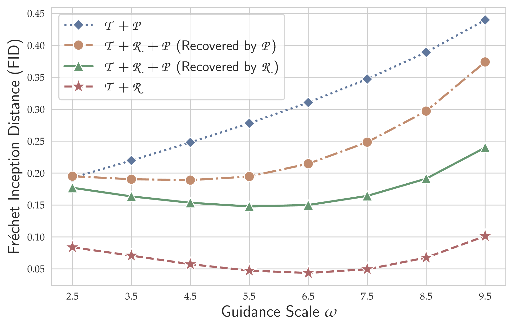{fig-alt="Ablation study comparing motion factor representations." width="78%" fig-align="center"}

### Conclusion

- $\mathcal{T} + \mathcal{R}$ is consistently the best and most guidance-stable representation.
- Adding pose coordinates $\mathcal{P}$ does not improve robustness.
- Rotation information is the critical ingredient for quality and stability.

---

### Does temporal differencing help?

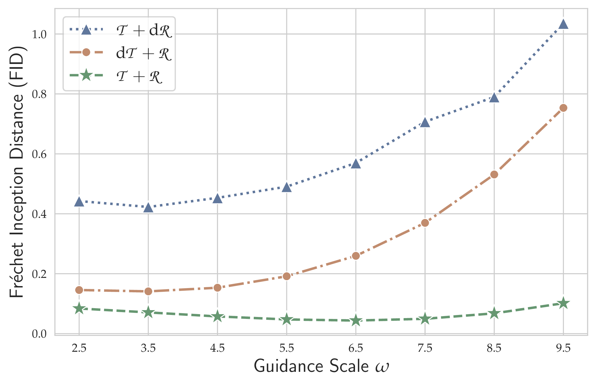{fig-alt="Ablation study on temporal difference modeling." width="78%" fig-align="center"}

### Conclusion

- Absolute modeling with $\mathcal{T} + \mathcal{R}$ performs best across the full guidance range.
- Temporal differencing weakens long-horizon structure and hurts stability.

## Final Takeaways

### RMG

- Models human motion in its natural non-Euclidean geometry
- Combines compact representation with Riemannian flow matching
- Delivers state-of-the-art or best-reported results on HumanML3D
- Scales effectively to MotionMillion

### Practical message

**Geometry-aware motion modeling is not only principled, but also effective and scalable.**

## Acknowledgements

We would like to thank the following libraries and repositories for their contributions to our project:

- [Geomstats](https://geomstats.github.io/) which provides the foundation for Riemannian manifolds
- [DiT](https://github.com/facebookresearch/DiT) which provides the foundation of our model architecture
- [HumanML3D](https://github.com/EricGuo5513/HumanML3D) and [MotionMillion](https://huggingface.co/datasets/InternRobotics/MotionMillion) which provide large-scale human motion datasets
- [MDM](https://github.com/GuyTevet/motion-diffusion-model), [MLD](https://github.com/ChenFengYe/motion-latent-diffusion), and [MotionStreamer](https://github.com/zju3dv/MotionStreamer) which provide substantial codebases. Some code in this repository is adapted from these projects.
- [Qwen3](https://github.com/QwenLM/Qwen3) and [Qwen3-Embedding](https://github.com/QwenLM/Qwen3-Embedding) for their amazing pretrained models, which we use as the text encoder in our model.
- [HY-Motion-1.0](https://github.com/Tencent-Hunyuan/HY-Motion-1.0), which provides real-time visualization
- [Hugging Face](https://huggingface.co/) which provides an amazing platform for model deployment, evaluation, and sharing.

---

### Project page

<https://frank-miao.github.io/RMG-Project-Page>

### Contact

<mailto:fangran.miao@connect.polyu.hk>
